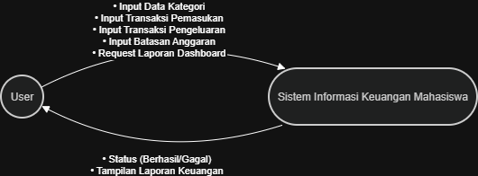
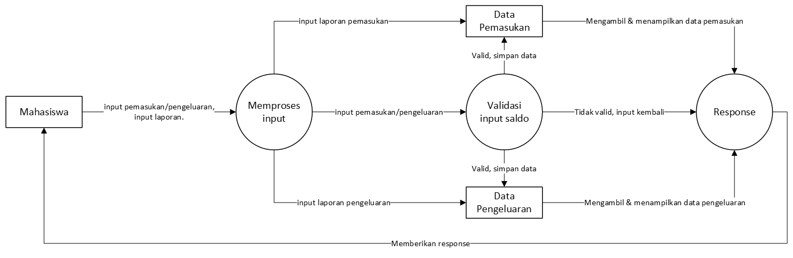
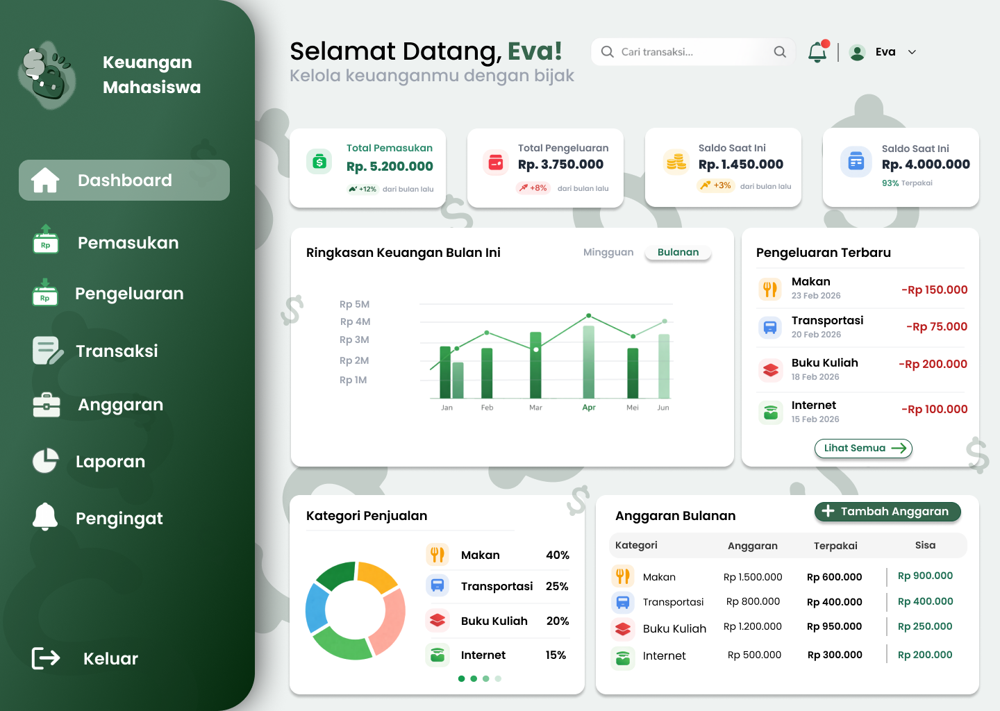
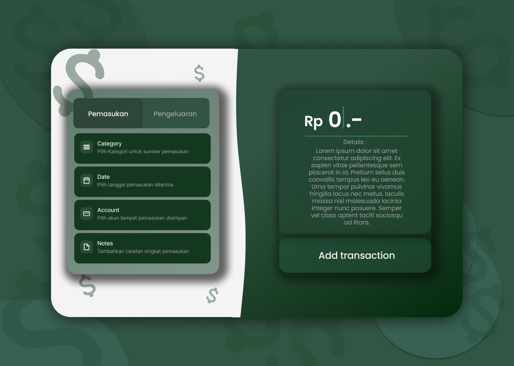

# 🚀 Tugas Besar: Pencatatan-Keuangan

> **Dosen Pengampu:** Muhammad Shiddiq Azis, S.T., MBA

---

## 📊 Perancangan Sistem (DFD)

### DFD Level 0

*Diagram Konteks yang menunjukkan aliran data global.*

### DFD Level 1

*Detail proses bisnis dan integrasi database.*

---

## 🎨 Mockup Antarmuka
Rancangan UI aplikasi yang berfokus pada pengalaman pengguna.

| Login Page | Dashboard | Core Feature |
| :---: | :---: | :---: |
|  |  |  |

---

## 🛠️ Stack Teknologi
- **Frontend:** Belum menentukan fix (Next.js / Java Swing)
- **Backend:** Belum menentukan fix (Node.js / Java)
- **Database:** Belum menentukan fix (PostgreSQL / MySQL)

---
